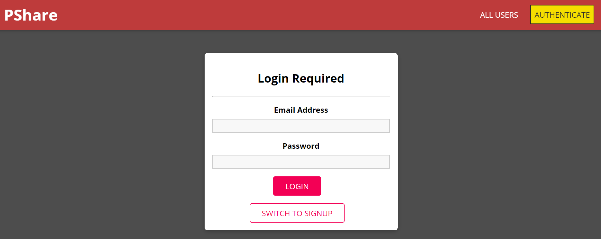
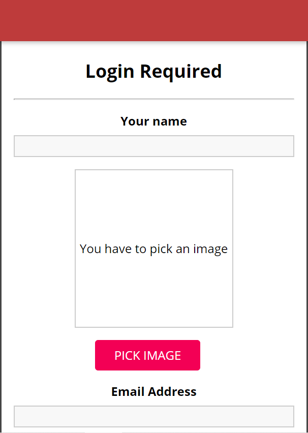
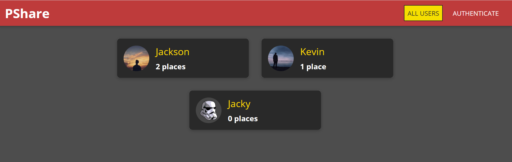
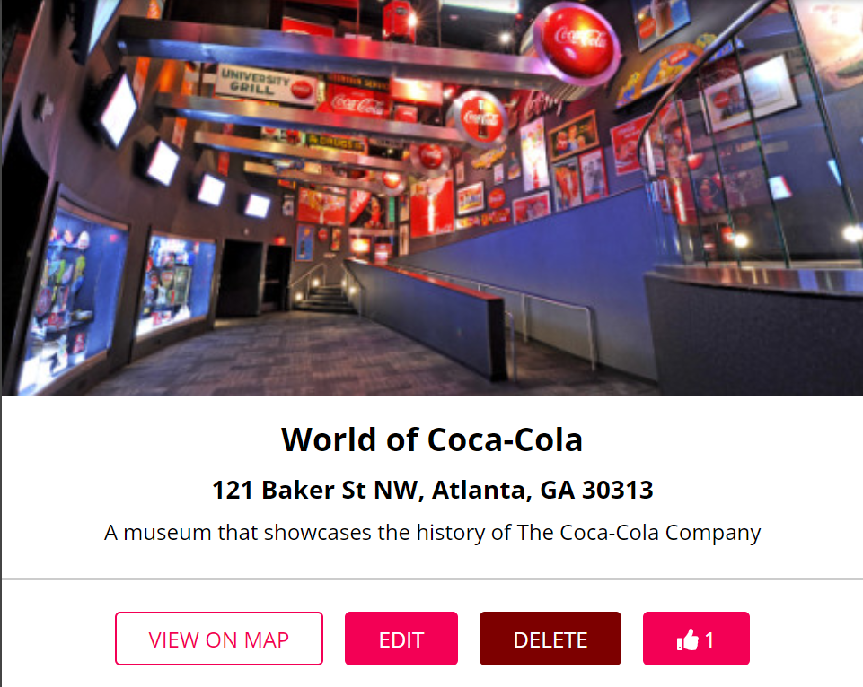
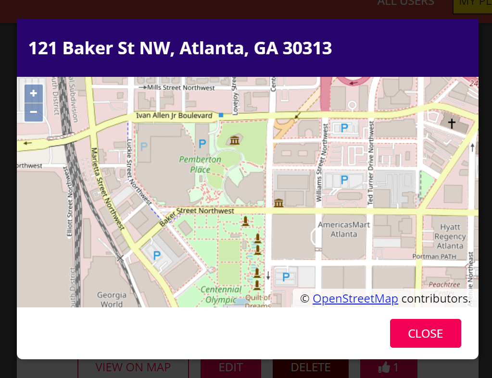

# PShare
A web applications built with React.js, Node.js, Express.js and MongoDB.  
https://pshare-project.web.app/

## Screenshots

### Login page 
 

 

### HomePage

 

### Place Card

### Map (OpenStreetMap API)
